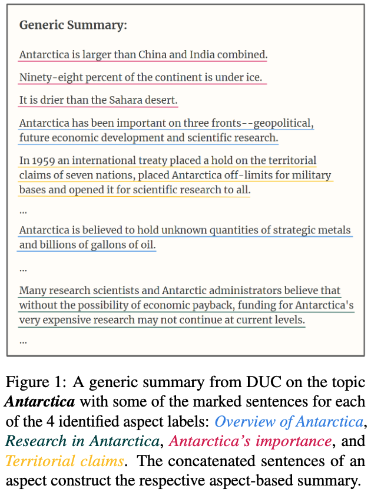

# OpenAsp Dataset

`OpenAsp` is an open aspect-based Multi Document Summarization derived from `DUC` summarization datasets and `MultiNews`.



## Dataset Access

To generate `OpenAsp`, you require access to the `DUC` dataset which OpenAsp is derived from.

### Steps:

1. Grant access to DUC dataset by following NIST instructions [here](https://duc.nist.gov/data.html).
   * you should receive two user-password pairs (for DUC01-02 and DUC06-07)
   * you should receive a file named `fwdrequestingducdata.zip`
2. Clone this repository by running the following command: `git clone https://github.com/liatschiff/OpenAsp.git`
3. Optionally create a `conda` or `virtualenv` environment:

```bash
conda create -n openasp 'python>3.10,<3.11'
conda activate openasp
```

4. Install python requirements, currently requires python3.8-3.10 (later python versions have issues with `spacy`)

```bash
pip install -r requirements.txt
```

5. copy `fwdrequestingducdata.zip` into the `OpenAsp` repo directory

6. run the prepare script command:

```bash
python prepare_openasp_dataset.py --nist-duc2001-user '<2001-user>' --nist-duc2001-password '<2001-pwd>' --nist-duc2006-user '<2006-user>' --nist-duc2006-password '<2006-pwd>'
```

7. load the dataset using [huggingface datasets](https://huggingface.co/docs/datasets/index)

```python
from glob import glob
import os

from datasets import load_dataset

openasp_files = os.path.join('openasp-v1', '*.jsonl.gz')

data_files = {
    os.path.basename(fname).split('.')[0]: fname
    for fname in glob(openasp_files)
}

# load OpenAsp as huggingface's dataset
openasp = load_dataset('json', data_files=data_files)

# print first sample from every split
for split in ['train', 'valid', 'test']:
    sample = openasp[split][0]

    # print title, aspect_label, summary and documents for the sample
    title = sample['title']
    aspect_label = sample['aspect_label']
    summary = '\n'.join(sample['summary_text'])
    input_docs_text = ['\n'.join(d['text']) for d in sample['documents']]

    print(f'Sample from {split} split title={title} aspect label={aspect_label}')
    print(summary)
    print('\ninput documents:\n')
    for i, doc_txt in enumerate(input_docs_text):
        print(f'---- doc #{i} ----')
        print(doc_txt[:256] + '...')
```

### Troubleshooting

1. **Dataset failed loading with `load_dataset()`** - you may want to delete huggingface datasets cache folder
2. **401 Client Error: Unauthorized -** you're DUC credentials are incorrect, please verify them (case sensitive, no extra spaces etc)
3. **Dataset created but prints a warning about content verification -** you may be using different version of `NLTK` or `spacy` model which affects the sentence tokenization process. You must use exact versions as pinned on `requirements.txt`.
4. **IndexError: list index out of range -** similar to (3), try to reinstall the requirements with exact package versions. 


### Under The Hood

The `prepare_openasp_dataset.py` script downloads `DUC` and `Multi-News` source files, uses `sacrerouge` package to
prepare the datasets and uses the `openasp_v1_dataset_metadata.json` file to extract the relevant aspect summaries and compile the final OpenAsp dataset.


## License

This repository, including the `openasp_v1_dataset_metadata.json` and `prepare_openasp_dataset.py`, are released under [APACHE license](LICENSE).

`OpenAsp` dataset summary and source document for each sample, which are generated by running the script, are licensed under the respective generic summarization dataset - [Multi-News license](https://github.com/Alex-Fabbri/Multi-News/blob/master/LICENSE.txt) and [DUC license](https://duc.nist.gov/data.html).
